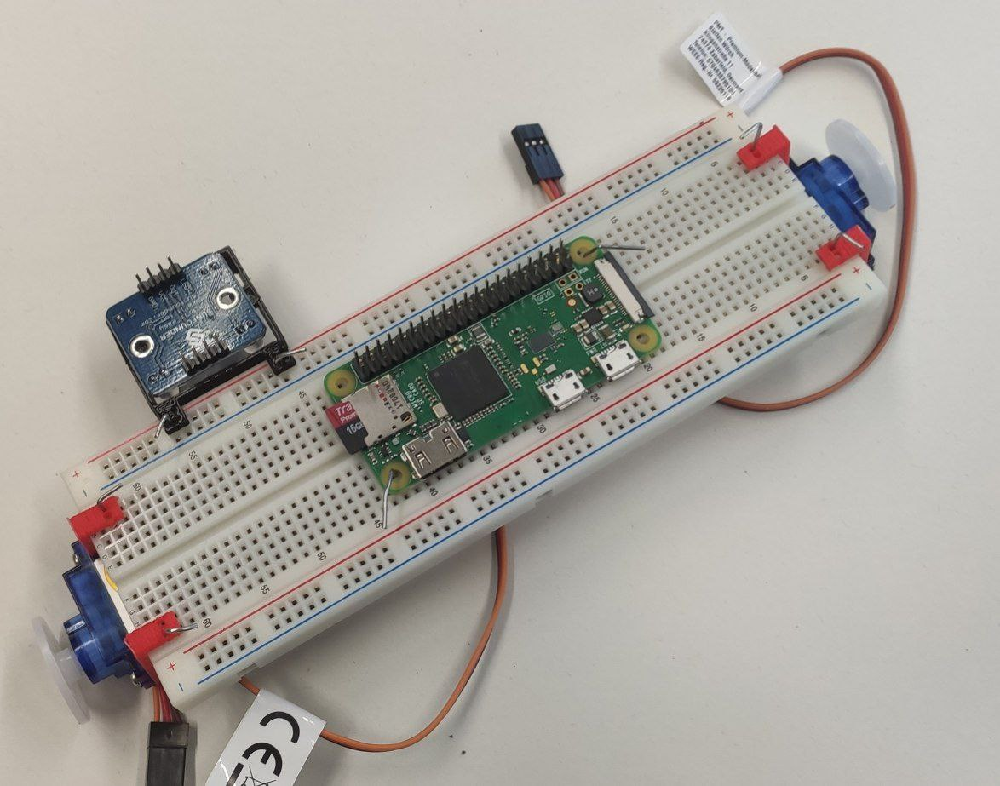
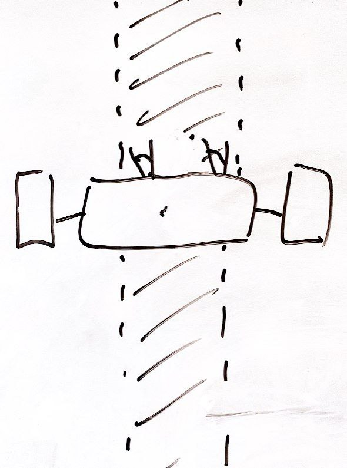
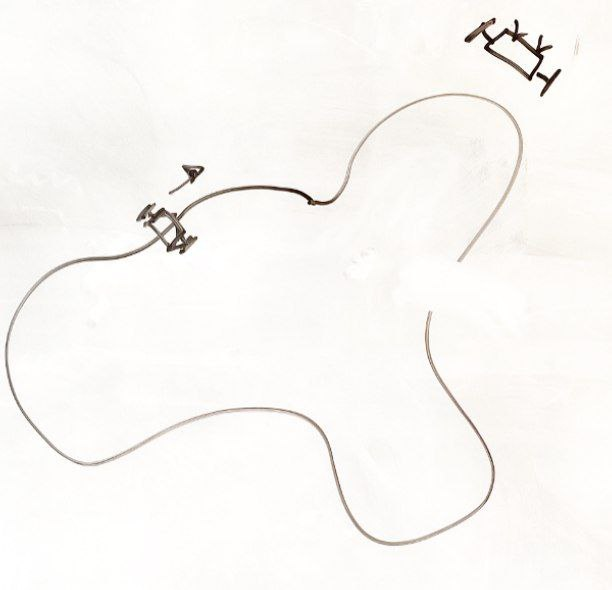
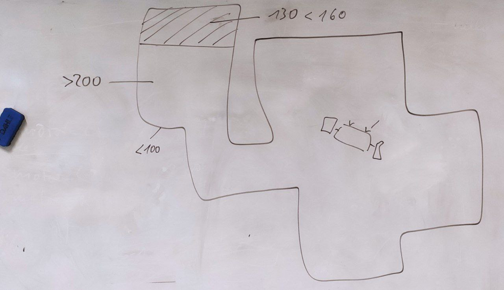

# BreadBoardRobot (BBR)

The BreadBoardRobot is a minimalistic robot designed specifically for educational purposes, encompassing both hardware and software components.

## Core Principles

**Minimalistic Design:**
- **Resource Constraints:** The German education system often faces limitations in time and funding, making a simplified approach essential.
- **Comprehensibility:** Each component of the robot is designed to be easily understandable, ensuring that students grasp the fundamental concepts of robotics.
- **Encouragement of Improvement:** The design encourages students to innovate and enhance the robot, fostering a hands-on learning experience.

## Illustrative Simplicity

The design is simple enough that problems can be illustrated using pen and paper, allowing students to sketch solutions in their notes, not just on whiteboards.

